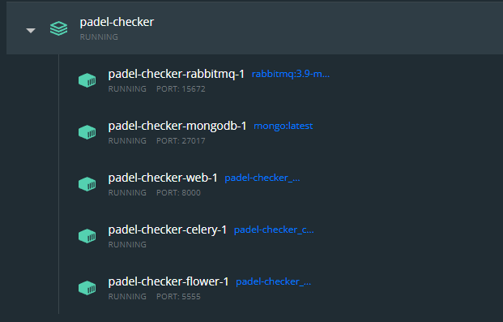

<div style="text-align: center">
<h1>Padel Checker</h1>

</div>

---
A tool which its main goal is to notify if a court becomes available during X schedule in a certain area.

---

Core Features:

- **Fetch Available Slots**: pick a date and a time and fetch all the available slots where you can book a court.


- **Create Watchers**: create a watcher for a certain period and get notified via e-mail when a new slot pops up.


- **Define your favorite clubs**: this way, you only get notified in courts of interest.


## Requirements

**Python**: 3.6 and later (tested against 3.6, 3.7, 3.8 and 3.9)

**MongoDB**: 4.0 and later (MongoDB is not containerized, but you can add it on the docker-compose.yml)

**Docker**: 20.10 and later

**Docker Compose**: 1.29.2 and later

**[Typer](https://typer.tiangolo.com/)**

**MailJet Account** to send emails to users.

## Installation

```shell
git clone https://github.com/AndreMPCosta/padel-checker-pub.git
```

After:
```shell
cd padel-checker-pub
```

Run:
```shell
pip install typer
```

Configure your env variables with:
```shell
python start.py
```


And finally:
```shell
docker-compose up
```

If everything went smoothly, you should have these following containers:


## Usage

To check flower dashboard navigate to:
```
http://localhost:5555/
```

There you can watch the fetching task being executed every minute (These tasks are being coordinated by **Celery**).

To access the docs for the endpoints:

```
http://localhost:8000/docs
```


*Notes*: This repository is intended to be used on Portugal, it is using Aircourts API to fetch data.
