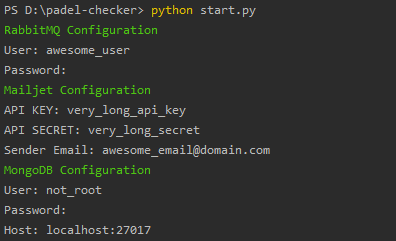

<div style="text-align: center">
<h1>Padel Checker</h1>

</div>

---
A tool which its main goal is to notify if a court becomes available during X schedule in a certain area.

---

Core Features:

- **Fetch Available Slots**: pick a date and a time and fetch all the available slots where you can book a court.


- **Create Watchers**: create a watcher for a certain period and get notified via e-mail when a new slot pops up.


- **Define your favorite clubs**: this way, you only get notified in courts of interest.


## Requirements

**Docker**: 20.10 and later

**Docker Compose**: 1.29.2 and later

**MailJet Account** to send emails to users.

## Optional <h4>(to be able to use MailJet to send notifications by email, as customize MongoDB and RabbitMQ)</h4>

**Python**: 3.6 and later (tested against 3.6, 3.7, 3.8 and 3.9)

**[Typer](https://typer.tiangolo.com/)** (to run start script to customize everything)

## Installation

```shell
git clone https://github.com/AndreMPCosta/padel-checker-pub.git
```

After:
```shell
cd padel-checker-pub
```

<h4 style="color: darkcyan"> Optional Step </h4>

---

Run:
```shell
pip install typer
```

Configure your env variables with:
```shell
python start.py
```


---

It is advised for you to create a new folder and use your own .env files, based on the sample_environment folder.

For example, you can create a folder named **environment** and put the .env files there. After, just change the docker.env to point to that folder, ex:

```
ENVIRONMENT_FOLDER=environment
```

And finally:
```shell
docker-compose --env-file docker.env up
```

If everything went smoothly, you should have these following containers:


## Usage

To check flower dashboard navigate to:
```
http://localhost:5555/
```

There you can watch the fetching task being executed every minute (These tasks are being coordinated by **Celery**).

To access the docs for the endpoints:

```
http://localhost:8000/docs
```


*Notes*: This repository is intended to be used on Portugal, it is using Aircourts API to fetch data.
